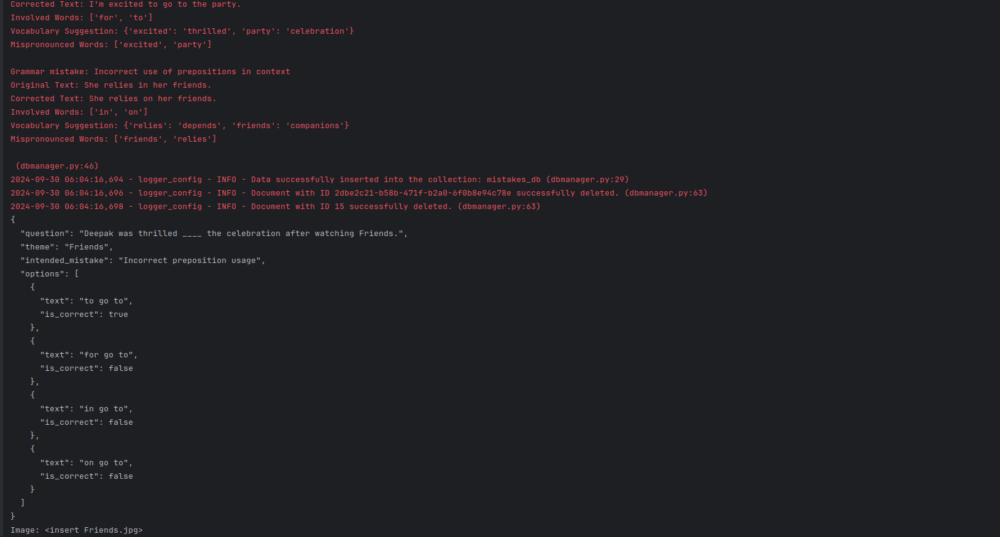
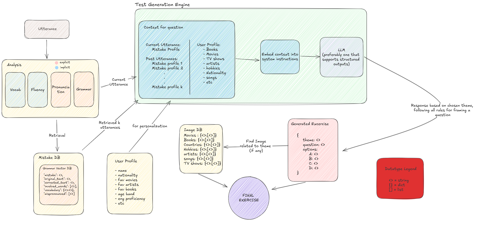
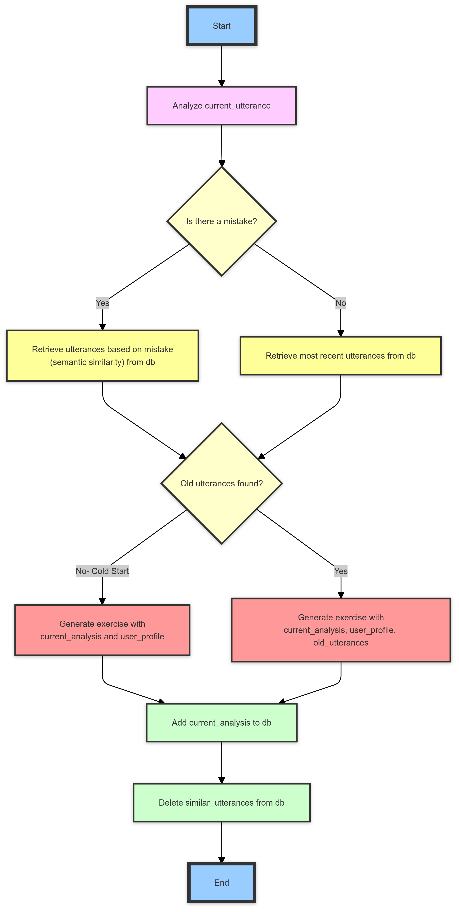

# Dynamic Recommender System for on-the-fly recommendations

Deepak C Nayak <br>
AI Junior, NITK, Surathkal <br>
 ---
# Insrtuctions to run the code:

- create a conda env using the `condarequiremnts.txt` file
- install the required pip packages (in `piprequirements.txt`)
- Set your open AI key (or load any llm of your choice from llama-index)
- Simply run the `test.py` file with any `GrammarMistake` object (or without it is fine too)

Sample outputs



# Assumptions (and sensible guesses)
1. Fluency is something the user develops over time by speaking constantly. The best practice for this would be make the user read out text in a guided manner (Like in the learn section of stimuler, where the user reads out something and the words turn green as the user is reading out.)
2. Vocabulary, is also something that comes with time, the user is more likely to learn a word when we show them how and where to use it
3. Pronunciation can be practised by repeating the mispronounced words.
4. Grammar mistakes are the best data source we can have since many utterances, albeit being about completely different topics, can have a grammatical error in common.
5. So a sensible and a reliable system would be capable of retrieving information from the past to leverage exercise generation and update the information regularly to keep in sync with the behaviour and learning of the user.

---
# The big picture
## Problems to solve:

### How should an exercise look like
- We have 4 fields: Fluency, Vocabulary, Pronunciation and Grammar.
- The approach I am suggesting involves breaking down these fields into explicit and implicit fields.
	- **Explicit**: These will be what the exercise will primarily be based on, these will shape the exercise
	- **Implicit**: These will be practised in the exercises although they are not the main focus. 
- We are treating fluency and vocabulary as implicit exercises. Which means they will be practised by the user no matter what the exercise is about.
- The way I plan to enforce fluency and vocabulary practice is by having good vocabulary built into the right answer for any exercise, such that choosing the right answer will automatically also make them learn new vocab and then for fluency we can have guided utterance of the right answer for every exercise.
- Grammar: We will store each utterance where the user has made a grammatical mistake along with other data in the following order:
```json 
{
    "id": 20,
    "timestamp": "2024-09-30T11:35:00Z",
    "mistake": "Using wrong verb form in simple past",
    "original_text": "We choose the best option yesterday.",
    "corrected_text": "We chose the best option yesterday.",
    "involved_words": ["choose", "chose"],
    "vocabulary": {"option": "choice", "best": "optimal"},
    "mispronounced": ["yesterday"]
}
```

- This is because the most effective exercise for fluency is guided utterance. The most effective way to practice pronunciation is repetition. The most effective way to practice vocabulary is to see and understand where a word can be used and by understanding the meaning of it. The most effective way to practice grammar is to understand what right grammar looks like and using it often.
- So ultimately, our exercise should:
	- Enforce right grammar
	- Have the use utter words they struggle with
	- Have the user learn new words
	- Have the user utter an ideal "chunk"/"paragraph" in a guided manner.
We will call the above "**the 4 rules**".

### How to decide what exercise to generate:

We need to design exercises that can be derived from the user's old mistakes. This is where our grammar vector DB comes into play.

Let's recap:
- Vocab is implicit
- Fluency is implicit
- Pronunciation is being practiced by making the user utter words they struggle with
- The main focus point here is the grammar. This is where we can decide what should our exercise be about.
	- How?
		- We use our grammar vector DB to retrieve utterances where the user had previously done similar grammatical mistakes (relating to verb, relating to preposition, etc).
		- We search for such utterances by embedding the grammatical mistake that the user did in the current utterance and then querying the db for similar mistake descriptions.
		- Now we haven't addressed the problem for cold start here yet, we will tackle that later.

So to wrap up, we decide what exercise to generate mainly based on the grammar mistake the user does in the current utterance and then retrieving the utterances where they had done a similar mistake.

This will be used as context to generate our exercise. 

But, why base the exercise on a mistake the user is doing right now compared to the most repetitive mistakes they have done in the past?
- To maintain continuity. It is better to have the user learn to amend their most recent mistakes because that's what their entire learning "context" is about. If we randomly choose to make an exercise about a mistake they made long ago, it might have lost the context and will struggle more, hence making the user experience worse.

### The exercise
Any exercise we design should follow the 4 rules we have defined earlier. 
One example I can think of (also with the help of clues in the statement) is a fill in the blanks exercise that is of the following structure:

- Blah blah blah <\blank> blah.
- Options:
	- A (wrong)
	- B (correct)
	- C (wrong)
The key here is, option B should inherently :
- be the right answer to the question
- have words that the user can learn (new vocab)
- have words that the user struggles to pronounce (we can use old data here)

Now where does our context come in this?
If we look back at the way we are storing each utterance, we see that we also are storing mispronounced words and the suggested vocabulary enhancements. 
In short, this is our context to generate the exercise:
	- The current mistake (grammatical)
	- The current mispronounced words
	- The vocabulary suggestions in the current utterance
	- The similar mistakes we retrieved from past
	- The mispronounced words in the retrieved data
	- The vocabulary suggestions in the retrieved data

So these are more or less the ingredients we need to make an exercise that adheres to the 4 rules we came up with earlier and also is based on the previous mistakes of the user.

With some clever prompt engineering, using this is the context, we should be able to generate very personalized exercises with ease.

### Personalization:
Now we will worry about adding a hint of personalization to our exercises. We want the exercise to resonate with the user.

This can also be incorporated easily by using the information in the user profile. We can collect information like
	- Favorite movies
	- Favorite books
	- Favorite TV shows
	- Hobbies
	- Favorite artists
	- Favorite songs
The core idea here is that any entity belonging to any of the things mentioned above can be the theme of our exercise. The user likes harry pottor? We can include that in context and prompt the LLM to generate a harry pottor based question. User is a swiftie? Same formula.

### Multimodality:
We can have a database of images, each having a label associated with them. We can have 10 harry potter images, 10 hardy boys, sci - fi movies, etc.
There is 2 ways to go about this. Remember we are generating the exercise based on a theme. 
- We can either only choose to take themes that are a overlap between the the user's interest and the images we have
- Or we can first generate the exercise and transform it into a multimodal one if we happen to have an image pertaining to that theme.
Personally I feel the second approach is better because we are not limited by the types of images we have.

### Putting it all together:

The whole idea can be represented in a block diagram. We still have some things to cover, but the idea so far is:

---
# Diving deeper

## Addressing Cold Start 
Now it is time to think deeply about how we go about retrieval.
Other than cold start, we have quite a few scenarios where our retrieval pipeline will not retrieve anything:
- When the user does not make a grammatical mistake (hence we do not have anything to retrieve based on)
- When the user is new (classic cold start)

Here is how we are going to tackle both:
- In the case where the user is not making any mistake (which is good), we can retrieve the most recent mistake they made in case the holy algorithm decides to show them an exercise. Most recent because language is a complex thing and someone is more likely to have learnt to tackle a mistake they made long ago (because of exercises back then) compared to their very recent mistakes.
- In the case where the user is new, we *ideally* shouldn't prompt an exercise if they are making no mistakes, and when they do, although we do not have any data to retrieve, we can use the current analysis and the user profile to generate the exercise.

The whole thing can be represented as this algorithm:


```pseudocode
ALGORITHM GENERATE_EXERCISE (current_utterance, db, user_profile):
1. current_analysis = analyse(current_utterance)

3. if current_analysis.mistake is none:
    3.1. old_utterances = db.retrieve_most_recent()
    3.2. if old_utterances is none: // cold start
        generate(current_analysis, user_profile)
    else:
        generate(current_analysis, user_profile, old_utterances)
else:
    3.3. old_utterances = db.retrieve(analysis.mistake) // based on semantic similarity
    3.4. if old_utterances is none: // cold start
        generate(current_analysis, user_profile)
    else:
        generate(current_analysis, user_profile, old_utterances)
4. db.add(current_analysis)
5. db.delete(similar_utterances)
```

## Addressing adapting to user's profile:
If we see the last 2 steps in the algorithm, we are updating the db by adding the most recent mistake (current_analysis) and deleting the entries the exercise was created from. This ensures we are always keeping track of the mistakes the user is doing right now and getting rid of the things we have made them successfully practice.

The flowchart can make it easier to understand:

